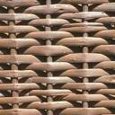
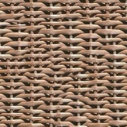
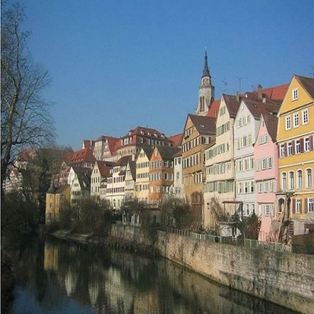
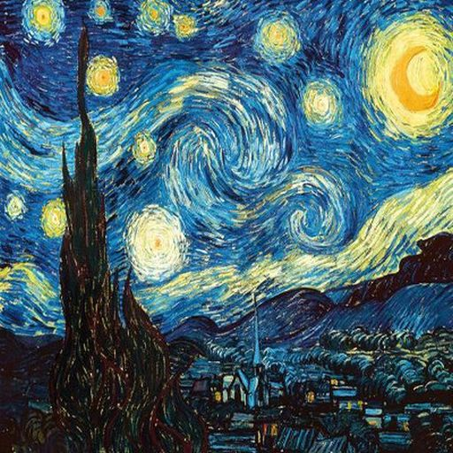

# Paper Implementation
I have implemented the main parts of the following two papers.
"Style Transfer" uses the same method as "Texture Synthesis", so I have combined them into one module.
The purpose of this repository is just to see what results can be obtained from the methods in the papers.

- V. Kwatra, I. Essa, A. Bobick and N. Kwatra, "Texture optimization for example-based synthesis", ACM Trans. Graph., vol. 24, no. 3, pp. 795-802, 2005.
- M. Elad and P. Milanfar, "Style Transfer Via Texture Synthesis," in IEEE Transactions on Image Processing, vol. 26, no. 5, pp. 2338-2351, May 2017.

## Texture optimization for example-based synthesis
| Input sample | Output |
----| ---- 
| | |

### How to use
See or run `test_texture_synthesis.py`.

### Not implemented method (propsed in the paper)
- Call-off function applied to the patch during the EM algorithm in the paper.
- Flow-guided synthesis

## Style Transfer Via Texture Synthesis
| Content | Style | Result |
----| ---- | ----
|  |  | |

### How to use
See or run `test_style_transfer.py`.

### Not implemented method (propsed in the paper)
- Any segmentation
    - Instead, using edge detection to calculate the weights and fuse contents.
- Denoise by domain-transform
- ANN using PCA
    - Instead, "NN using hierarchical clustering" and "ANN using FAISS" are implemented.
